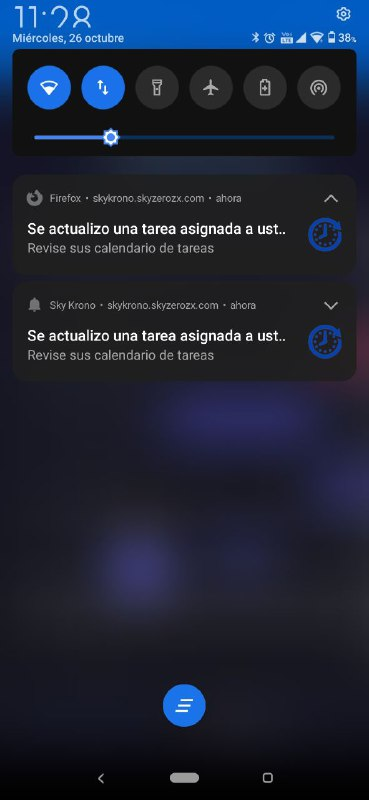

<h1 align="center">Sky Krono App</h1>
  <p align="center">
 Es el modulo web del sistema de registro de asistencias y tareas de calendario con notificaciones push a traves del <a href="https://github.com/SkyZeroZx/API-Sky-Krono" target="_blank"> API Sky Krono en NestJS 
  </p>
<p align="center">
<a href="https://sonarcloud.io/project/overview?id=SkyZeroZx_Sky-Krono-App" target="_blank">
  
</a>

<a href="https://sonarcloud.io/project/overview?id=SkyZeroZx_Sky-Krono-App" target="_blank">
  
</a>

<a href="https://sonarcloud.io/project/overview?id=SkyZeroZx_Sky-Krono-App" target="_blank">
  
</a>

<a href="https://sonarcloud.io/project/overview?id=SkyZeroZx_Sky-Krono-App" target="_blank">
  
</a>

<a href="https://sonarcloud.io/project/overview?id=SkyZeroZx_Sky-Krono-App" target="_blank">
  
</a>

<a href="https://sonarcloud.io/project/overview?id=SkyZeroZx_Sky-Krono-App" target="_blank">
  
</a>

<a href="https://sonarcloud.io/project/overview?id=SkyZeroZx_Sky-Krono-App" target="_blank">
  
</a>


</p>

_Adicionalmente funciona como PWA(Progresive Web App) que puede integrarse en cualquier dispositivo movil_

## :ledger: Index

- [Pre-Requisitos](#pre-requisitos-)
- [Instalación](#instalación-)
- [PWA](#ejecutando-como-pwa-)
- [Desarrollo](#desarrollo-%EF%B8%8F)
  - [Unit-Test](#unit-test)
  - [E2E-Test](#e2e-test)
- [Web-Authentication](#web-authn-fingerprint-)
- [Despligue](#despliegue-)
  - [Build](#build)
  - [Docker](#docker)
- [Analisis de Codigo](#analisis-de-codigo-)
- [CI / CD](#integración-continua---despligue)
- [Generar APK](#generar-apk)
- [Construido](#construido-con-)

## Comenzando 🚀

_Estas instrucciones te permitirán obtener una copia del proyecto en funcionamiento en tu máquina local para propósitos de desarrollo y pruebas._

_Puede visualizar una Demo del Proyecto en el siguiente enlace : https://skykrono.skyzerozx.com/#/login_

_**Administrador**_

```
skyzerobot64@gmail.com
Admin1
```

_**Empleado**_

```
empleado-demo@gmail.com
Admin1
```

Mira **Deployment** para conocer como desplegar el proyecto.

### Pre-requisitos 📋

_Software requerido_

```
NodeJS >= 14.X
NPM >= 8.X
AngularCli >= 14.X
```

_Software opcional_

```
Visual Studio Code ( O el editor de su preferencia)
```

### Instalación 🔧

_Para ejecutar un entorno de desarrollo_

_Previamente ejecutar el comando en la terminal para descargar "node_modules" para el funcionamiento del proyecto_

```
npm install
```

_Previamente configurar la ruta del API que consumira nuestro proyecto en el archivo **"src/environments/environment.ts"** campo **API_URL**_

_Para ejecutar un servidor de pruebas local usar el comando donde **"PUERTO"** sera el puerto donde deseamos ejecutar el proyecto , por default **ng serve** ejecuta el puerto 4200_

```
ng serve --port [PUERTO]
```

_Dirigirse a la ruta http://localhost:4200/#/login/ se tendra la pantalla de Login del sistema_

_**Login** : Apartado de inicio de sesion para ambos tipos de roles_

_**Change Password** : Apartado para el cambio de contraseña_

_**Inicio** : Apartado para visualizar estado de las ultimas 2 semanas de asistencias_

_**Asistencia** : Apartado para registrar la asistencia diaria del empleado asi como enviar alguna nota de registro en caso de ser necesario_

_**Profile** : Apartado de perfil del sistema del usuario donde puede actualizar sus datos personales , habilitar notificaciones , fingerprint authentication , nav bar mode y dark theme o light theme demanda (Se envia notificaciones push a los usuarios suscritos)_

_**Contactos**: Vista en forma de lista de contactos de celular para visualizar los contactos existentes de manera facil como correo electronico , número celular y WhatsApp_

_**Calendario** : Apartado con el calendario de tareas , registro de tareas , edicion , eliminacion (Se envia notificaciones push a los usuarios suscritos)_

_**Gestion de Usuarios** : Apartado para la gestion de usuarios con un horario asignado , creacion , reseteo , edicion , eliminacion_

_**Tipos** : Aprtado para registar los tipos de tareas a crear en el calendario con un color a demanda_

_**Cargos**: Apartado para crear el cargo representativo para los usuarios en el sistema_

_**Licencias**:Apartado para registrar licencias de los empleados asi como vacaciones o según sea requerido_

_**Horarios**: Apartado para registrar horarios de entrada/salida de los empleados_

  <p align="center">
</p>

## Ejecutando como PWA 👨🏻‍💻

_Para ejecutar como PWA(Progressive Web App) , previamente debe tenerse instalado la libreria http-serve_

```
npm install --global http-server
```

_Una vez instalada proceder a ejecutar el siguiente comando , que nos permite ejecutar en entorno local nuestra PWA_

```
npm run start-pwa
```

_Este comando se encuentra configurado en el archivo *package.json de la raiz del proyecto por default ejecuta el puerto 8080*_

_La PWA se encuentra configurada para ejecutarse en la vista de Login si no se esta logeado_

_Se cuenta con soporte de notificaciones Push integrado para el calendario tanto para escritorio como dispositivos moviles_

_Se creo el archivo `custom-service-worker.js` para la gestion de evento de notificaciones personalizado_

<p align="center">

</p >

## Desarrollo ⚙️

_Las siguientes instrucciones serviran para ejecutar en su entorno local la pruebas unitarias realizadas para el proyecto_

### Unit-Test

_Para ejecutar todos los Unit Test desarrollados en Jasmine/Karma y reporte de cobertura de codigo ejecutar el comando_

```
 ng test --code-coverage
```

_La carpeta con la cobertura del codigo se creara en la raiz del proyecto con la siguiente ruta coverage-unit-test/Sky_Krono/index.html el cual se puede visualizar_


### E2E-Test

_Para ejecutar todos los E2E Test desarrollados en Cypress y reporte de cobertura se tienen dos comandos_

_Previamente configurar los archivos `cypress.config.mobile.ts` y `cypress.config.ts`_

_Para ejecutar en vista desktop ejecutar :_

```
 npm run e2e:ci
```

_Para ejecutar en vista mobile(PWA) ejecutar :_

```
 npm run e2e:ci:mobile
```

_Al finalizar tendremos un reporte de los test ejecutados_


_Se generara la carpeta `coverage-e2e` con la cobertura de codigo del proyecto_

_Adicionalmente puede visualizar los videos recopilados por cypress en la carpeta `cypress/videos`_


## Web Authn FingerPrint 👨🏻‍💻

_Cuenta con soporte para logeo mediante huella dactilar o patron/pin del dispostivo movil usando el estandar web authn_

<p align="center">

</p >
 
_Para habilitarlo ir al profile del usuario logeado_

<p align="center">

</p >

_Más informacion de Web Authn : https://webauthn.io/_

## Despliegue 📦

### Build

_Previamente configurar la ruta del API que consumira nuestro proyecto en el archivo src/environments/environment.prod.ts campo API_URL_

_Para realizar el despligue a produccion del proyecto ejecutar el siguiente comando_

```
ng build --configuration production
```

_El cual creara la carpeta "dist" en la raiz de nuestro proyecto el cual podemos desplegar en cualquier servidor que ejecute HTML CSS y JS_

_A su vez en un hosting con certificado HTTPS se podra ejecutar como una PWA que se podra "instalar"_

### Docker

_Para desplegar el proyecto mediante Docker se tiene los archivos `Dockerfile` y `docker-compose.prod.yaml`, los cuales tienen preconfigurado la imagen y dependencias necesarias para levantar el proyecto, se utilizo como base un servidor web Nginx_

_Para construir la imagen y ejecutarla tenemos el siguiente comando_

_Ejecutar el siguiente comando en la raiz del proyecto_

```
 docker-compose -f docker-compose.prod.yaml up --build
```


_En caso de requerir volver a ejecutar el contenedor del proyecto previamente creado ejecutar el comando:_

```
 docker-compose -f docker-compose.prod.yaml up
```

## Analisis de Codigo 🔩

_**Pre requisitos**_

_En la raiz del proyecto se tiene el archivo *sonar-project.properties* el cual tiene las propiedades necesarias para ejecutarlo sobre un SonarQube_

_Configurar los apartados : *sonar.host.url* , *sonar.login* *sonar.password* con los datos de su instancia correspondiente o usar SonarCloud con su token correspondiente_

```
Sonaqube >= 9.X
```


_Las pruebas fueron realizas sobre *SonarQube 9.5* y *SonarCloud* para ejecutar el analisis de codigo ejecutar el comando para la instancia local:_

```
npm run sonar
```

_Reporte de Cobertura en SonarQube_


_Reporte de Cobertura en SonarCloud_


## Integración Continua - Despligue

_Se realizo un CI con SonarCloud para ejecuta de manera automatica los test_

_Se realizo un CD mediante las github actions para desplegar mediante FTP en un hosting_

_Se creo la carpeta `.github/workflows` con el archivo `build.yml` que contiene los pasos para desplegar mediante GitHub Actions nuestro CI_

_Adicionalmente se generan artifacts con los reportes y evidencias de nuestro CI/CD para posterior conservación_


## Generar Apk

_Para generar un APK y posteriormente publicarlo se usara bubblewrap , el cual nos permite generar nuestra apk apartir del TWA(Trusted Web Activites)_

_Adicionalmente puede publicarse oficialmente en la PlayStore como un aplicación Android_

_Previamente instalar el CLI de bubblewrap con el siguiente comando_

```
npm i -g @bubblewrap/cli
```

_Inicializar el proyecto con el el `manifest.webmanifest` y este previamente publicado como una PWA en dominio con HTTPS , ejecutar el comando:_

```
bubblewrap init --manifest=https://YOUR_WEB_URL/manifest.webmanifest
```

_Realizar los pasos que se indican en consola teniendo previamente configurado las propiedades adecuadas de una PWA_


_Una vez finalizada la configuración ejecutar el siguiente comando_

```
bubblewrap build
```


_Más información https://developer.chrome.com/docs/android/trusted-web-activity/quick-start/_

## Construido con 🛠️

_Las herramientas utilizadas son:_

- [Angular](https://angular.io/docs) - El Framework para Desarrollo Web
- [NPM](https://www.npmjs.com/) - Manejador de dependencias
- [Jasmine](https://jasmine.github.io/) - Framework Testing para pruebas unitarias
- [Karma](https://karma-runner.github.io/latest/index.html) - Test Runner para pruebas unitarias
- [Cypress](https://www.cypress.io/) - Framework para pruebas E2E
- [Visual Studio Code](https://code.visualstudio.com/) - Editor de Codigo
- [SonarQube](https://www.sonarqube.org/) - Evaluacion de codigo on premise
- [SonarCloud](https://sonarcloud.io/) - Evaluacion de codigo cloud
- [Prettier](https://prettier.io/) - Formateador de Codigo
- [TabNine](https://www.tabnine.com/) - Autocompletador de Codigo
- [WebAuthn](https://webauthn.io/) - Web Authentication
- [BubbleWarp](https://github.com/GoogleChromeLabs/bubblewrap) - CLI para crear APK usando TWA apartir de una PWA
- [Black DashBoard](https://www.creative-tim.com/product/black-dashboard-angular) - Plantilla Web Utilizada

## Versionado 📌

Usamos [GIT](https://git-scm.com/) para el versionado.

## Autor✒️

- **Jaime Burgos Tejada** - _Developer_
- [SkyZeroZx](https://github.com/SkyZeroZx)
- Email : jaimeburgostejada@gmail.com

## Licencia 📄

Este proyecto está bajo la Licencia - mira el archivo [LICENSE.md](LICENSE.md) para detalles
